### AUTOMATE INFRASTRUCTURE WITH IAC USING TERRAFORM. PART 3 – REFACTORING

- In two previous projects we have developed AWS Infrastructure code using Terraform and tried to run it from your local workstation.
Now it is time to introduce some more advanced concepts and enhance your code.


## Step 1 REFACTOR YOUR PROJECT USING MODULES
### Terraform Modules and best practices to structure  `.tf` codes

- Module is just a collection of .tf and/or .tf.json files in a directory.
- Created a folder called `modules`
- The Terraform codes were broke down into resources( other folders created )  in their respective `sub-modules`. Resources of a similar type into directories within a `‘modules’` directory. see below

- modules
  - ALB: Apllication Load balancer and similar resources
  - EFS: Elastic file system resources
  - RDS: Databases resources
  - Autoscaling: Autosacling and launch template resources
  - compute: EC2 and related resources
  - VPC: VPC and netowrking resources such as subnets and roles
  - security: security group resources

- Each module contain following files:

  - main.tf 
  - outputs.tf 
  - variables.tf

## Step 2 Configuring  S3 Bucket and DynamoDB Table

- create ` providers.tf and maint.tf ` and place them in the `root module`.

- Add the below code to the `main.tf` file to create the `S3 bucket` and `DynamoDB table`

- Make sure the `S3 bucket is unique`

``` 
#create S3 bucket

resource "aws_s3_bucket" "terraform-state" {
  bucket = "babadeen-terraform-bucket"
  force_destroy = true
}
resource "aws_s3_bucket_versioning" "version" {
  bucket = aws_s3_bucket.terraform-state.id
  versioning_configuration {
    status = "Enabled"
  }
}
resource "aws_s3_bucket_server_side_encryption_configuration" "first" {
  bucket = aws_s3_bucket.terraform-state.id
  rule {
    apply_server_side_encryption_by_default {
      sse_algorithm = "AES256"
    }
  }
}

resource "aws_dynamodb_table" "terraform_locks" {
  name         = "terraform-locks"
  billing_mode = "PAY_PER_REQUEST"
  hash_key     = "LockID"
  attribute {
    name = "LockID"
    type = "S"
  }
}

``` 
- let us run `terraform init, terraform plan and terraform apply` to provision resources.

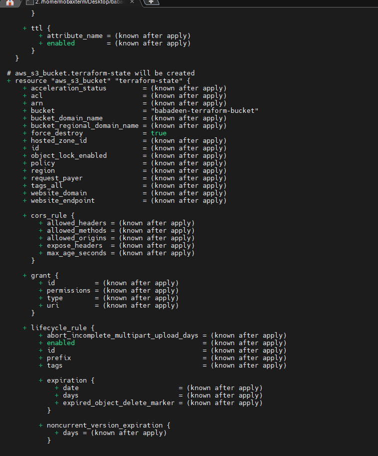


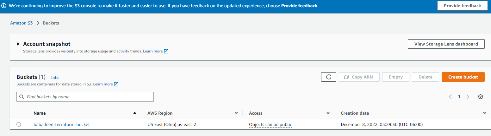

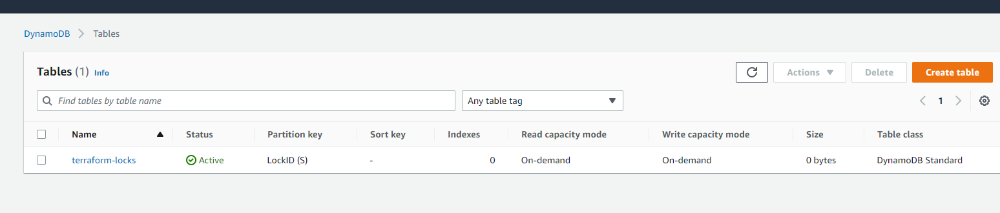


## Step 3 REFACTORING USING MODULES for VPC,ALB,EFS,RDS,SECURITY,AUTOSCALLING and COMPUTE

- created the following `VPC,ALB,EFS,RDS,SECURITY,AUTOSCALLING and COMPUTE `sub-directories and placing them under `modules` directory created above. 

![image of PBL-18-NEW Directory module structure]
(./Images/p18-details-structure.PNG)

- Each sub-directories have files created as follows `main.tf, variables.tf and output.tf`

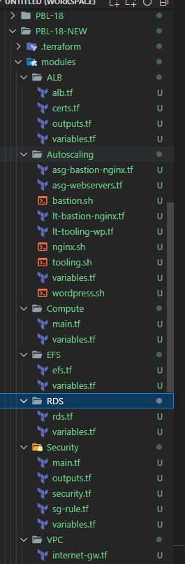

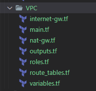

- Now we have everything ready to go! Let us `run terraform apply` to crete all the resources above 

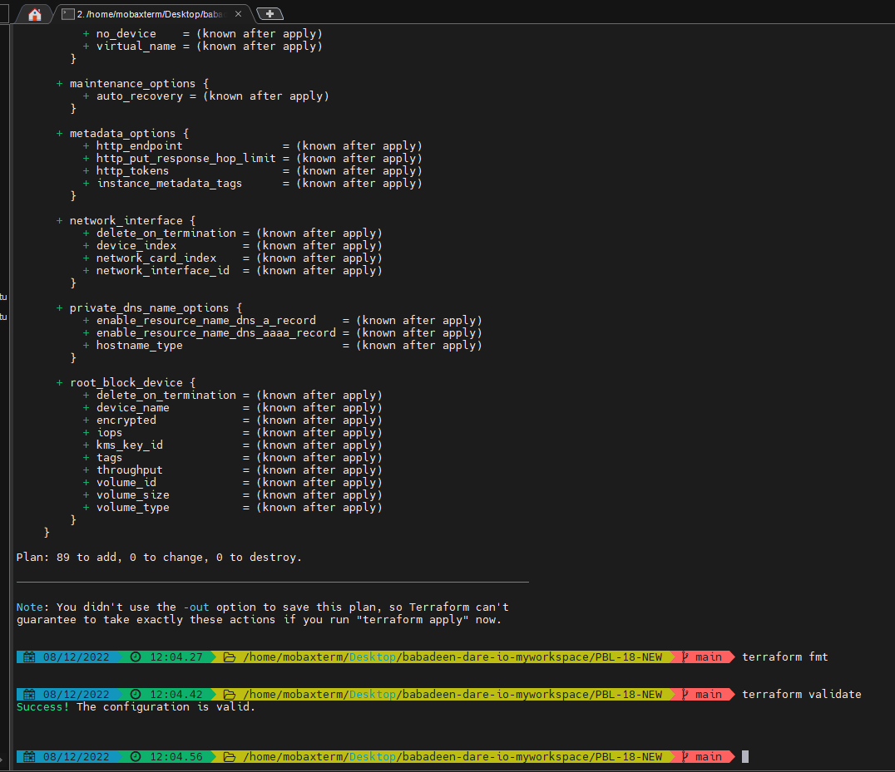

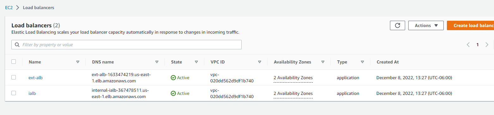

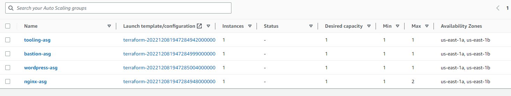

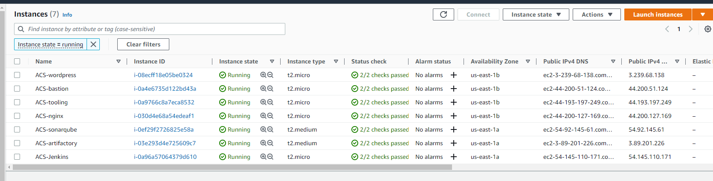

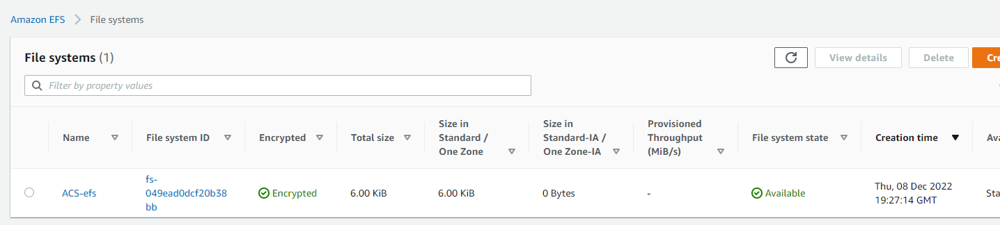

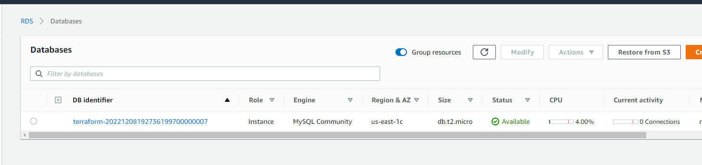

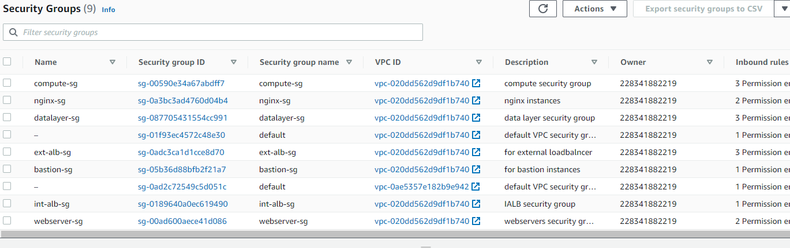

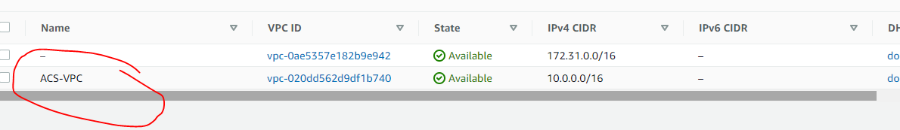

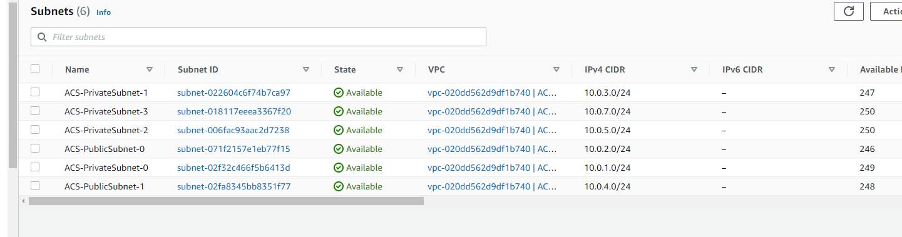

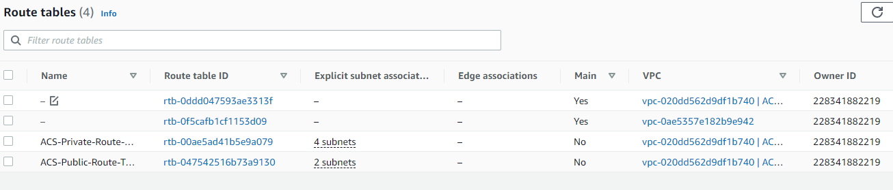

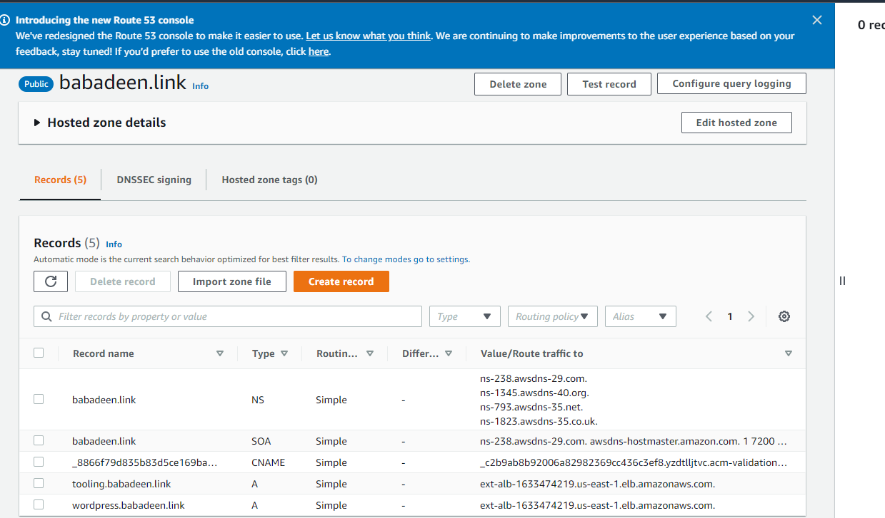

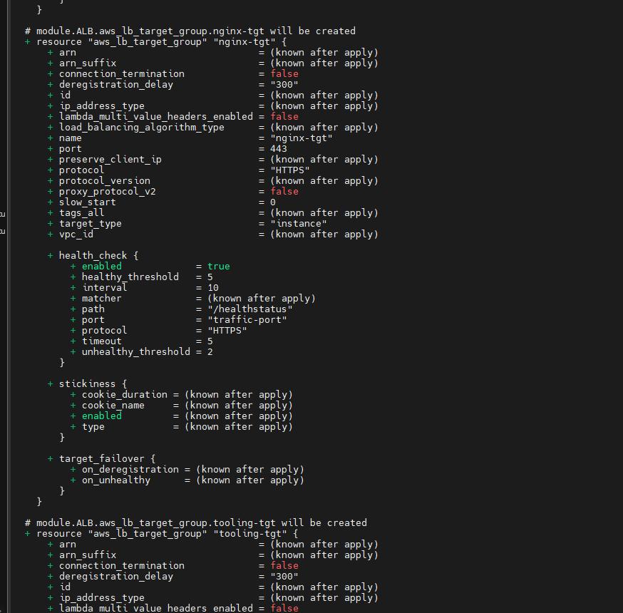

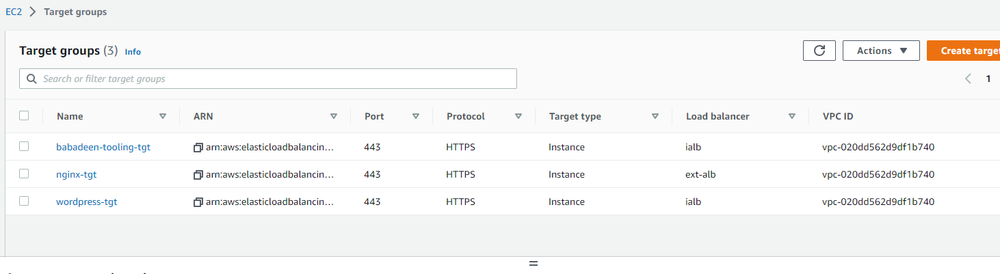

! [image of KMS key](./Images/p18-kms-key.PNG)


# Introducing Backend on S3 we created above 

- Terraform expects that both `S3 bucket and DynamoDB ` resources are already created before we configure the `backend.tf`

- Configure S3 Backend add the below code to the `backend.tf `file place it under the `root module `

``` 
terraform {
  backend "s3" {
    bucket         = "babadeen-terraform-bucket"
    key            = "global/s3/terraform.tfstate"
    region         = "us-east-1"
    dynamodb_table = "terraform-locks"
    encrypt        = true
  }
}

```
- Now its time to re-initialize the `backend.tf`  file  `Run terraform init` and confirm you are happy to change the backend by typing `yes`

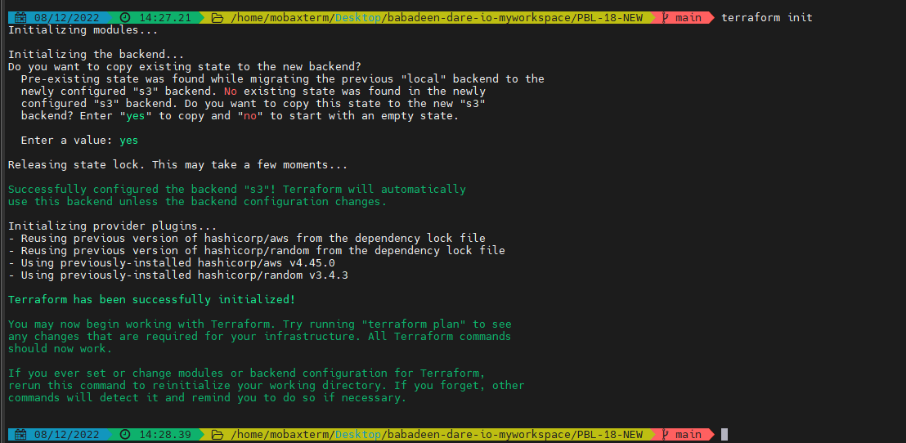

- Verify the changes Before doing anything if you opened AWS now to see what happened you should be able to see the following:

- tfstatefile is now inside the S3 bucket

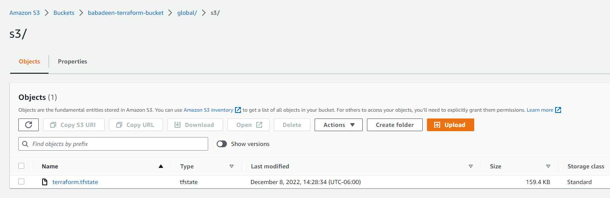

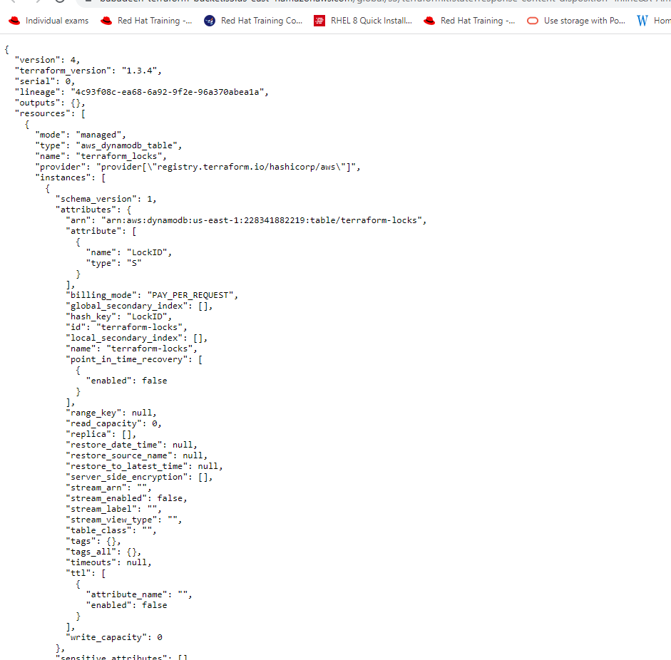


- DynamoDB table which we created has an entry which includes state file status


- Navigate to the DynamoDB table inside AWS and leave the page open in your browser. `Run terraform plan` and while that is running, refresh the browser and see how the lock is being handled:

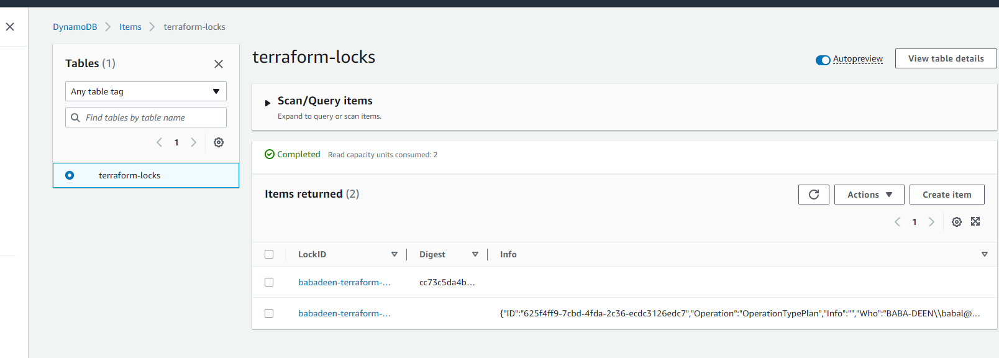


